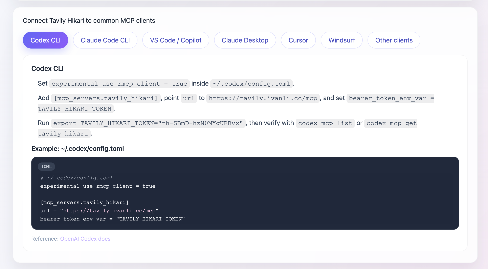
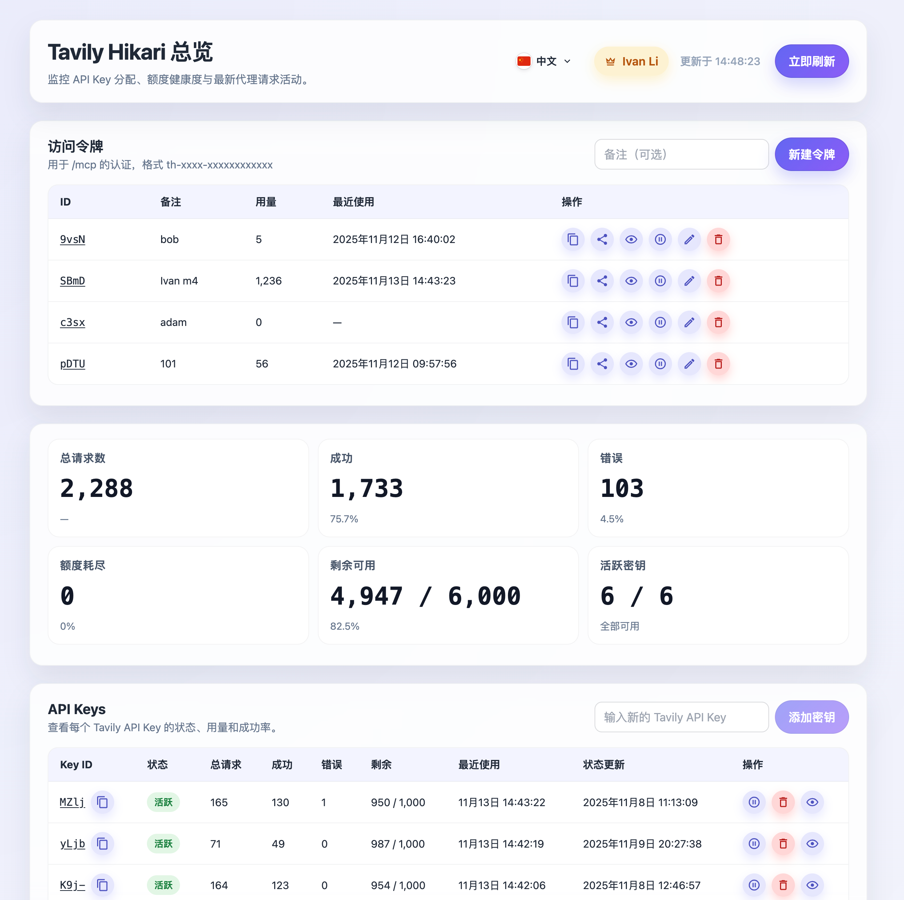
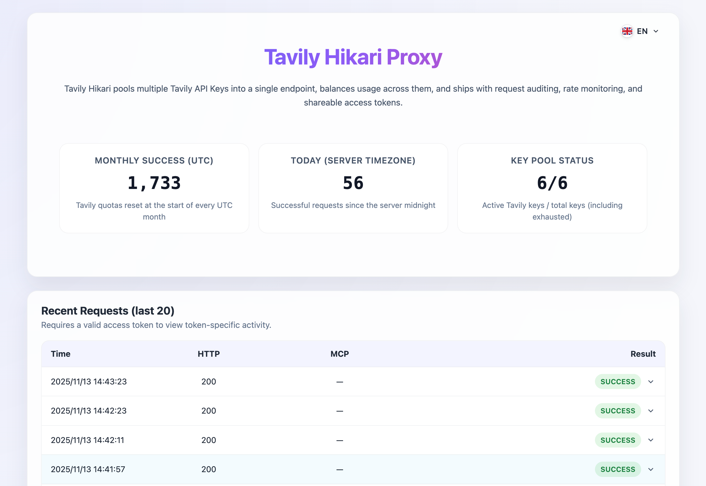

# Tavily Hikari

[](https://github.com/IvanLi-CN/tavily-hikari/releases)
[](https://github.com/IvanLi-CN/tavily-hikari/actions/workflows/ci.yml)
[](rust-toolchain.toml)
[](web/package.json)
[](README.zh-CN.md)

Tavily Hikari is a Rust + Axum proxy for Tavily's MCP endpoint. It multiplexes multiple API keys, anonymizes upstream traffic, stores full audit logs in SQLite, and ships with a React + Vite web console for realtime visibility.

> Looking for the Chinese documentation? Check [`README.zh-CN.md`](README.zh-CN.md).

## Why Tavily Hikari

- **Key pool with fairness** – SQLite keeps last-used timestamps so the scheduler always picks the least recently used active key.
- **Short IDs and secret isolation** – every Tavily key receives a 4-char nanoid. The real token is only retrievable via admin APIs/UI.
- **Health-aware routing** – status code 432 automatically marks keys as `exhausted` until the next UTC month or manual recovery.
- **High-anonymity forwarding** – only `/mcp` traffic is tunneled upstream; sensitive headers are stripped or rewritten. See [`docs/high-anonymity-proxy.md`](docs/high-anonymity-proxy.md).
- **Full audit trail** – `request_logs` persists method/path/query, upstream responses, error payloads, and the list of forwarded/dropped headers.
- **Operator UI** – the SPA in `web/` visualizes key health, request logs, and admin actions (soft delete, restore, reveal real keys).
- **CI + Docker image** – GitHub Actions runs lint/test/build and publishes `ghcr.io/ivanli-cn/tavily-hikari:<tag>` with prebuilt web assets.

## Architecture Snapshot

```
Client → Tavily Hikari (Axum) ──┬─> Tavily upstream (/mcp)
                                ├─> SQLite (api_keys, request_logs)
                                └─> Web SPA (React/Vite)
```

- **Backend**: Rust 2024 edition, Axum, SQLx, Tokio, Clap.
- **Data**: SQLite single-file DB with `api_keys` + `request_logs`.
- **Frontend**: React 18, TanStack Router, Tailwind CSS, DaisyUI, Vite 5 (served from `web/dist` or via Vite dev server).

## Quick Start

### Local dev

```bash
# Start backend (high port recommended during dev)
cargo run -- --bind 127.0.0.1 --port 58087

# Optional: start SPA dev server
cd web && npm ci && npm run dev -- --host 127.0.0.1 --port 55173

# Register Tavily keys via admin API (ForwardAuth headers depend on your setup)
curl -X POST http://127.0.0.1:58087/api/keys \
  -H "X-Forwarded-User: admin@example.com" \
  -H "X-Forwarded-Admin: true" \
  -H "Content-Type: application/json" \
  -d '{"api_key":"key_a"}'
```

Visit `http://127.0.0.1:58087/health` for a health check or `http://127.0.0.1:55173` for the console. Keys should be managed via the admin API or SPA instead of environment variables.

### Docker

```bash
docker run --rm \
  -p 8787:8787 \
  -v $(pwd)/data:/srv/app/data \
  ghcr.io/ivanli-cn/tavily-hikari:latest
```

The container listens on `0.0.0.0:8787`, serves `web/dist`, and persists data in `/srv/app/data/tavily_proxy.db`. Once it is up, register keys via the admin API/console.

### Docker Compose

```bash
docker compose up -d

# Seed initial keys (requires ForwardAuth headers)
curl -X POST http://127.0.0.1:8787/api/keys \
  -H "X-Forwarded-User: admin@example.com" \
  -H "X-Forwarded-Admin: true" \
  -H "Content-Type: application/json" \
  -d '{"api_key":"key_a"}'
```

The stock [`docker-compose.yml`](docker-compose.yml) exposes port 8787 and mounts a `tavily-hikari-data` volume. Override any CLI flag with additional environment variables if needed.

## CLI Flags & Environment Variables

| Flag / Env                                                        | Description                                                                                                    |
| ----------------------------------------------------------------- | -------------------------------------------------------------------------------------------------------------- |
| `--keys` / `TAVILY_API_KEYS`                                      | Optional helper for bootstrapping or local experiments. In production, prefer the admin API/UI to manage keys. |
| `--upstream` / `TAVILY_UPSTREAM`                                  | Tavily MCP upstream (default `https://mcp.tavily.com/mcp`).                                                    |
| `--bind` / `PROXY_BIND`                                           | Listen address (default `127.0.0.1`).                                                                          |
| `--port` / `PROXY_PORT`                                           | Listen port (default `8787`).                                                                                  |
| `--db-path` / `PROXY_DB_PATH`                                     | SQLite file path (default `tavily_proxy.db`).                                                                  |
| `--static-dir` / `WEB_STATIC_DIR`                                 | Directory for static assets; auto-detected if `web/dist` exists.                                               |
| `--forward-auth-header` / `FORWARD_AUTH_HEADER`                   | Request header that carries the authenticated user identity (e.g., `Remote-Email`).                            |
| `--forward-auth-admin-value` / `FORWARD_AUTH_ADMIN_VALUE`         | Header value that grants admin privileges; leave empty to disable.                                             |
| `--forward-auth-nickname-header` / `FORWARD_AUTH_NICKNAME_HEADER` | Optional header for displaying a friendly name in the UI (e.g., `Remote-Name`).                                |
| `--admin-mode-name` / `ADMIN_MODE_NAME`                           | Override nickname when ForwardAuth headers are missing.                                                        |
| `--dev-open-admin` / `DEV_OPEN_ADMIN`                             | Boolean flag to bypass admin checks in local/dev setups (default `false`).                                     |

If `--keys`/`TAVILY_API_KEYS` is supplied, the database sync logic adds or revives keys listed there and soft deletes the rest. Otherwise, the admin workflow fully controls key state.

## HTTP API Cheat Sheet

| Method   | Path                   | Description                                            | Auth        |
| -------- | ---------------------- | ------------------------------------------------------ | ----------- |
| `GET`    | `/health`              | Liveness probe.                                        | none        |
| `GET`    | `/api/summary`         | High-level success/failure stats and last activity.    | none        |
| `GET`    | `/api/keys`            | Lists short IDs, status, and counters.                 | none        |
| `GET`    | `/api/logs?limit=50`   | Recent proxy logs (default 50).                        | none        |
| `POST`   | `/api/keys`            | Admin: add/restore a key. Body `{ "api_key": "..." }`. | ForwardAuth |
| `DELETE` | `/api/keys/:id`        | Admin: soft-delete key by short ID.                    | ForwardAuth |
| `GET`    | `/api/keys/:id/secret` | Admin: reveal the real Tavily key.                     | ForwardAuth |

## Key Lifecycle & Observability

- `exhausted` status is triggered automatically when upstream returns 432; scheduler skips those keys until UTC month rollover or manual recovery.
- Least-recently-used scheduling keeps load balanced across healthy keys; if all are disabled, the proxy falls back to the oldest disabled entries.
- `request_logs` captures request metadata, upstream payloads, and dropped/forwarded header sets for postmortem analysis.
- High-anonymity behavior (header allowlist, origin rewrite, etc.) is detailed in [`docs/high-anonymity-proxy.md`](docs/high-anonymity-proxy.md).

## ForwardAuth Integration

Tavily Hikari relies on a zero-trust/ForwardAuth proxy to decide who can operate admin APIs. Configure the following environment variables (or CLI flags) to match your identity provider:

```bash
export FORWARD_AUTH_HEADER=Remote-Email
export FORWARD_AUTH_ADMIN_VALUE=admin@example.com
export FORWARD_AUTH_NICKNAME_HEADER=Remote-Name
```

- Requests must include the header defined by `FORWARD_AUTH_HEADER`. If its value equals `FORWARD_AUTH_ADMIN_VALUE`, the caller is treated as an admin and can hit `/api/keys/*` privileged endpoints.
- `FORWARD_AUTH_NICKNAME_HEADER` (optional) is surfaced in the UI to show who is operating the console. When absent, the backend falls back to `ADMIN_MODE_NAME` (if provided) or hides the nickname.
- For purely local experiments you can set `DEV_OPEN_ADMIN=true`, but never enable it in production.

## Frontend Highlights

- Built with React 18, TanStack Router, DaisyUI, Tailwind, Iconify.
- Displays live key table, request log stream, and admin-only actions (copy real key, restore, delete).
- `scripts/write-version.mjs` stamps the build version into the UI during CI releases.
- `npm run dev` proxies `/api`, `/mcp`, and `/health` to the backend to avoid CORS hassle during development.

## Screenshots

Operator and integration views of Tavily Hikari.

### MCP Client Setup



### Admin Dashboard



### User Dashboard



## MCP Clients

Tavily Hikari speaks standard MCP over HTTP and works with popular clients:

- [Codex CLI](https://developers.openai.com/codex/cli/reference/)
- [Claude Code CLI](https://www.npmjs.com/package/@anthropic-ai/claude-code)
- [VS Code — Use MCP servers](https://code.visualstudio.com/docs/copilot/customization/mcp-servers)
- [GitHub Copilot — GitHub MCP Server](https://docs.github.com/en/copilot/how-tos/provide-context/use-mcp/set-up-the-github-mcp-server)
- [Claude Desktop](https://claude.com/download)
- [Cursor](https://cursor.com/)
- [Windsurf](https://windsurf.com/)
- Any MCP client supporting HTTP + Bearer token auth

Example (Codex CLI — ~/.codex/config.toml):

```
experimental_use_rmcp_client = true

[mcp_servers.tavily_hikari]
url = "https://<your-host>/mcp"
bearer_token_env_var = "TAVILY_HIKARI_TOKEN"
```

Then set the token and verify:

```
export TAVILY_HIKARI_TOKEN="<token>"
codex mcp list | grep tavily_hikari
```

## Development

- Rust toolchain pinned to 1.91.0 via `rust-toolchain.toml`.
- Common commands: `cargo fmt`, `cargo clippy -- -D warnings`, `cargo test --locked --all-features`, `cargo run -- --help`.
- Frontend: `npm ci`, `npm run dev`, `npm run build` (runs `tsc -b` + `vite build`).
- Hooks: run `lefthook install` to enable automatic `cargo fmt`, `cargo clippy`, `npx dprint fmt`, and `npx commitlint --edit` on every commit.
- CI: `.github/workflows/ci.yml` runs lint/tests/build and publishes Docker images to GHCR.

## Deployment Notes

1. Only expose `/mcp`, `/api/*`, and static assets; everything else returns 404.
2. Protect admin APIs/UI via ForwardAuth or another zero-trust proxy so regular users never see real keys.
3. Follow the header sanitization guidance in [`docs/high-anonymity-proxy.md`](docs/high-anonymity-proxy.md) when operating in high-anonymity environments.
4. Persist `tavily_proxy.db` via volumes or external storage and export `request_logs` for compliance if needed.

## License

Distributed under the [MIT License](LICENSE). Keep the license notice intact when copying or distributing the software.
